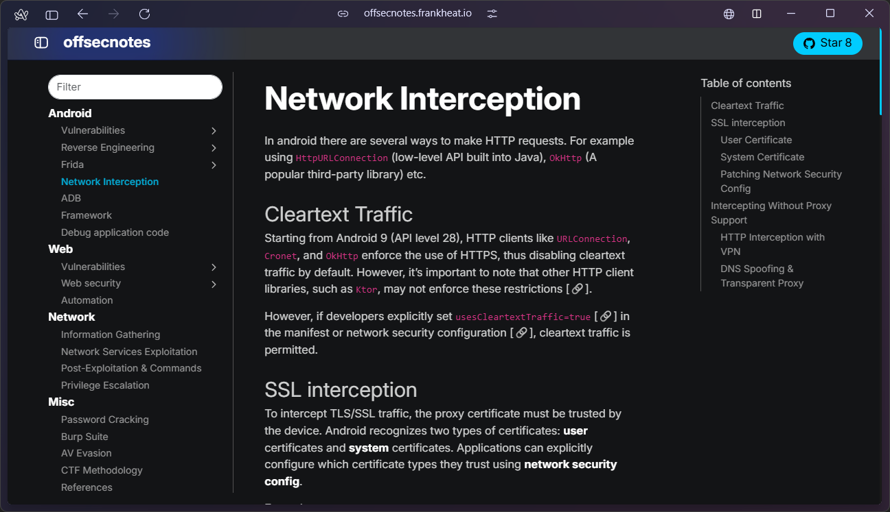

<h1 align="center">
  
   
  offsecnotes
   
</h1>

Welcome to offsecnotes, a website dedicated to Offensive Security notes. This project provides a collection of concepts, techniques, and tools useful for anyone interested in penetration testing and offensive security.

  <a href="https://offsecnotes.frankheat.io">Android</a> •
  <a href="https://offsecnotes.frankheat.io">Web App</a> •
  <a href="https://offsecnotes.frankheat.io">Network</a> •
  <a href="https://offsecnotes.frankheat.io">Misc</a>

# Project link

👉 https://offsecnotes.frankheat.io

# Table of contents

**ANDROID**

* Vulnerabilities
* Reverse engineering
* Frida
* Network interception
* Android debug bridge (ADB)
* Framework
* Debug application code

**WEB APPLICATION**

* Vulnerabilities
* Web security
* Reconnaissance

**NETWORK**

* Information gathering
* Network services exploitation
* Post-exploitation essentials
* Port forwarding

**LINUX**
* Linux commands
* Linux enumeration
* Linux privilege escalation

**WINDOWS**
* Windows enumeration
* Windows essentials
* Windows privilege escalation

**MISCELLANEOUS**

* Password racking
* Burp Suite
* AV evasion
* Metasploit
* CTF methodology
* References